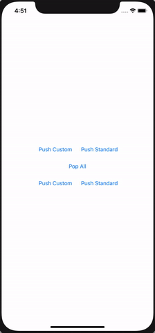

# NotificationStackView

A UIView derivative for in-app notification view

## Requirements
- iOS 11.0+

## Installation

### Swift Package Manager

Once you have your Swift package set up, adding the library as a dependency is as easy as adding it to the dependencies value of your Package.swift.

dependencies: [
    .package(url: "https://github.com/saddamakhtar88/NotificationStackView.git", .upToNextMajor(from: "1.0.0"))
]

## Public APIs

### NotificationStackView class

#### Functions 
- func push(view: UIView, popAfter: Double = 0)
- func pop(view: UIView? = nil)
- func popAll()

#### Properties
- containerView: UIView?
- containerEdgeInsets: UIEdgeInsets = UIEdgeInsets(top: 8, left: 8, bottom: 8, right: 8)
- verticalSpacing: CGFloat = 8.0
- delegate: NotificationStackViewDelegate?
- position: Position = .top

### NotificationView class

Standard notification view with a title and description label

#### Functions 
- init(title: String, description: String?)

#### Properties
- titleLabel: UILabel
- descriptionLabel: UILabel
- contentInset: UIEdgeInsets = UIEdgeInsets(top: 8, left: 8, bottom: 8, right: 8)

### NotificationStackViewDelegate protocol
- func didTap(notificationView: UIView, stackView: NotificationStackView)
